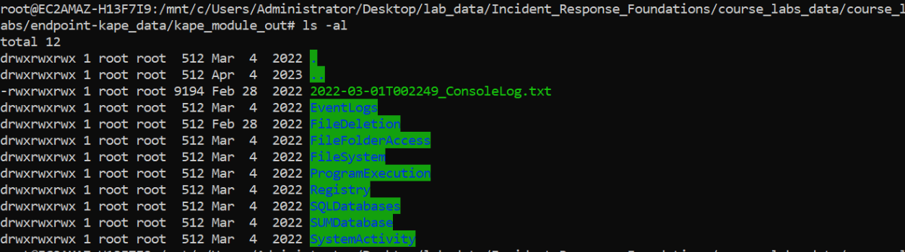
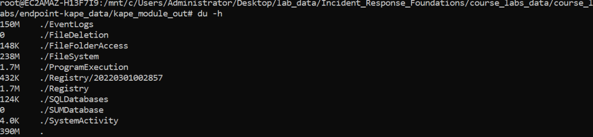

## Endpoint Logs Analysis KAPE Triage Data Collection

This lab will introduce you to parsing through text based data gathered from forensics data acquisition tools such as KAPE and Velociraptor.  These tools have the ability to not only collect the files necessary for an investigation but often the will parse known filetypes saving you time and allowing you to dive right into analysis.

In this lab, you as an Incident Responder have been notified that a user received a Windows Defender message that something malicious was cleaned up but then their system has been acting strangely.  The KAPET riage module was used to gather data for you and it has been parsed into CSV files. Your goal will be to analyze the parsed data and make a determination if malware potentially ran on the system, or did Defender prevent the malware from execution.  We will look at the network portion of the potential incident in a subsequent lab.

We will use WSL and TADViewer for this lab.  First we will change into the location in our analysis system that contains the data.

From the WSL prompt type `cd /mnt/c/Users/Administrator/Desktop/lab_data/Incident_Response_Foundations/course_labs_data/course_labs/endpoint-kape_dat/kape_module_out` to change to the directory that contains the authentication logs copied from the server in question.  Then use the `ls` to list the contents of the directory.  

Let's use some flags for the ls command to get some more details from the decompressed directories.  The 'l' switch will display long list format and the 'a' switch displays hidden folders.

```
ls -al
```

&nbsp;



&nbsp;

While using the 'a' and 'l' switches for ls gives us a more useful view, it doesn't let us know the file size of each directory.  We can accomplish this with the `du` command.
&nbsp;


&nbsp;

This is getting us closer, but its not clear (without reading the manual) what the numbers in front of the files and directories are.  Like almost all common Linux commands, flags following the commands change the processing options for that command.  For du, the -h command makes the output "human readable".

&nbsp;



&nbsp;

It appears that most of the data is from the FileSystem module and the EventLog module and the file sizes for the gathered data seem to be what we would expect.  We saw in an an earlier lab that the command line is one way to view, filter, and sort data text files.  You can also use spreadsheet programs, but know that they have data size limitations and have trouble with large files.  The files in this lab do not approach that limit, but it is good to use tools from the start that will meet your needs.

The [TAD Viewer](https://www.tadviewer.com/) is an example fast viewer program that can handle larger data sets.  Launch it from the desktop shortcut.

&nbsp;


&nbsp;

When starting a host investigation that involved malware, analyzing process execution is a good place to start. In the file open dialogue box navigate to `C:\Users\Administrator\Desktop\lab_data\Incident_Response_Foundations\course_labs_data\course_labs\endpoint-kape_data\kape_module_out\ProgramExecution` and open 'the 20220301002851_PECmd_Output.csv' file.


&nbsp;


&nbsp;

Scroll over to the "Last Run" column and click it to sort from the most recent to oldest date.  Take a moment to look at the applications run in the last hour or so.  Do any of these look malicious?  Unfortunately its rarely that easy, but this will help us paint a picture as we look at more data.

&nbsp;


&nbsp;

Next we should take a look at the event logs. In the TADViewer window got to the File menu and "Open File..." and open 20220301002458_EvtxECmd_Output.csv file in the `C:\Users\Administrator\Desktop\lab_data\Incident_Response_Foundations\course_labs_data\course_labs\endpoint-kape_data\kape_module_out\EventLogs` directory.  When asked if you want to open in a new or existing window, select the new window option.

&nbsp;


&nbsp;

There are 143,881 events so we will not be able to start reading through them all sequentially, we need to filter them down.  Usually in an Incident Response scenario, there is a pivot point of data where we can start.  In this case, the user mentioned a Defender pop up window, we can filter in TADViewer for this.  In the lower left hand corner of the TADViewer Window click "Filter".  Select "Provider" for the column, then select "contains" for the operator.  Type "Defender" in the text box, then click apply.

&nbsp;


&nbsp;


The filter should appear as below.

&nbsp;


&nbsp;

Click the header of the "Time Created" column to sort the data from newest to oldest.  Take a moment to read through the first 100 lines or so, you will notice that in the "Map Description" and "PayloadData1" fields, it is clear that Defender found multiple types of malware.  Also, if you scroll further to the right in the data, you will see that not only were local files and process executions but Defender found files on a file share on the Server01 system.  

&nbsp;


&nbsp;

On the local system, it appears that there was an attempt to run multiple executables from the C:\Users\dbanks\ directory, and there is a naming scheme of a number sequence and some text that seems related to Windows process internals.  This is certainly suspicious behavior in that typically executables should not be running from that specific profile location and the endpoint protection software indicates a remote access tool named Cobalt Strike associated with this behavior.

&nbsp;


&nbsp;

In a real world investigation the scope would have to expand to include the Server01 system, and would need to start with determining how these files ended up on a file share on a server.  However, there are still some unanswered questions about the host.  

The most important question is for this host is did malware successfully run?  When cross referencing with the process execution data, there does not appear to be an executable matching the naming scheme that the potential attacker was using.  That's good, but does that really mean that Defender saved the day?  

Ideally we could look at running processes and find the answer, but its not uncommon to be missing data in an IR.  In this case we do not have the volatile data for this system.

Microsoft Sysmon was installed on this system and was configured to log network data, so we could potentially gain more information there.  Clear the filter for Defender log entries and create a new filter where the "EventID" field equals 22 and the "PayloadData3" field contains the value "dbanks".  It does appear that there was some successful communication to two cloudfront domains.

&nbsp;


&nbsp;

Notice that the timestamps for this behavior are 30 minutes prior to the Defender log entries for the host.  We still to not have a clear picture of exactly what happened, but we do have enough information to consider this host likely compromised.  However, at this point in the investigation I would want to take a look at the associated network logs, we will do that in a subsequent lab.