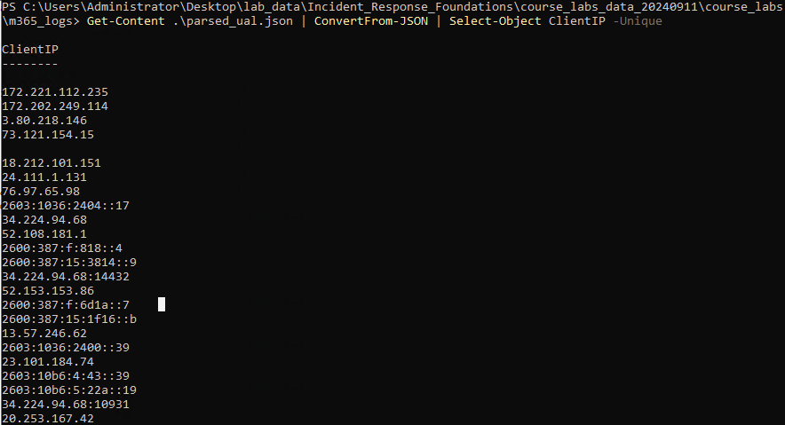

## M356 Audit Log 

This lab will introduce the [Microsoft M365 audit log](https://learn.microsoft.com/en-us/purview/audit-log-activities) (also known as the M365 Unified Audit Log) and command line parsing with PowerShell. The M365 audit log is a centralized record of user and administrative activities within an M365 environment, capturing critical actions across various services such as Exchange Online, SharePoint, OneDrive, Teams, and Azure AD. It provides detailed information on login events, file access, permission changes, and administrative tasks, making it essential for security investigations. Incident Responders can trace suspicious behavior, identify potential insider threats, or detect unauthorized access.

PowerShell is a command line environment historically associated with the Windows operating system and systems administrator type activity in a Windows environment and Microsoft cloud services.  Just as we have seen that Linux now runs under Windows, opening up the ability to use powerful Bash scripting in Windows through WSL, PowerShell is cross platform allowing Linux users to also have access to what PowerShell brings to the table.

A key difference between PowerShell and Bash scripting is that PowerShell handles data as objects where Bash works with text data streams.  Each of these approaches can be benificial and perform better in certain use cases. Many times that use case is specific "Command-lets" (usually seen refered to as cmdlets), which are structured commands to perform functions in a Windows environment, but also it could be useful when parsing certain data and data types. 

This M365 audit log file, as downloaded from [M365 Purview Audit Search](https://learn.microsoft.com/en-us/purview/audit-search?tabs=microsoft-purview-portal), pretends to be a CSV file at first glance. However, looks can be deceiving. The data we are most interested in is in the AuditData field and is imbeded JSON (JavaScript Object Notation), and the field preceding that (RecordID, CreationDate, RecordType, Operation, and UserID) are essentially meta data for the contents of the AuditData field.

&nbsp;


&nbsp;

When parsing this kind of format with the streams of text approach with Bash, it equates to a `jsonl` or a JSON lines file.  Its not impossible to do with utilites like `jq`, but field parsing and searching combinations can be tricky, the CLI commands get ugly, and if you are not careful output can be partial . Mainly this is because each value of AuditData is a JSON document, where each document is an ordered hierarchy of structured data composed of key:value pairs, and different docuemnts contain different key value pairs depending on the audit log entry. One can look at each JSON document as an object, and PowerShell can make this alot easier to deal with in many ways. Example JSON log entry below.

&nbsp;


&nbsp;

Change directory into the m365_logs directory, the `07a21bf5-7a4c-4c81-bffe-5d45dfdaeb25.csv` file contains the downloaded audit log data. Then run the `ParseUAL.ps1` script and use the `-InputFile` flag to specify the log file. This script will parse out each AuditData value, creating a JSONL file named `parsed_ual.json` that we will use for further processing. Do not forget that TAB completion is also a feature in PowerShell and will help you when typing long commands and file names.

```
cd C:\Users\Administrator\Desktop\lab_data\Incident_Response_Foundations\course_labs_data_20240911\course_labs\m365_logs\
.\ParseUAL.ps1 -InputFile .\07a21bf5-7a4c-4c81-bffe-5d45dfdaeb25.csv

```

&nbsp;


&nbsp;

Take a quick look at the `ParsUAL.ps1` script with Notepad++.  This script imports the CSV audit data file as an object.  The `Select-Object` cmdlet is then used to extract the vaules of the AuditData column of the spreadsheet (the JSON vaules we want to analyze) with the `-ExpandProperty` flag and write each line to a file with the `Out-File` cmdlet and the `-Append` flag, using the UTF8 Unicode Standard character endcoding.


&nbsp;


&nbsp;


Now run `Get-Content .\parsed_ual.json`, you should see many lines of JSON scroll down the PowerShell window.  How many lines?  Use the `Measure-Object` cmdlet to count the number of lines.

```
Get-Content .\parsed_ual.json | Measure-Object

```

&nbsp;


&nbsp;

PowerShell has a built-in cmdlet for parsing JSON named `ConvertFrom-JSON`.  It will create a PowerShell object for each line of JSON and allow us to extract out values for the key:value pairs.  For example if we wanted to extract out all of the client IP addresses connecting to the M365 services, we can combine it with the `Select-Object` cmdlet to get all values in the ClientIP field.  Note that the blank lines are from audit log entries that do not contain a ClientIP field.

```
Get-Content .\parsed_ual.json | ConvertFrom-JSON | Select-Object ClientIP

```

&nbsp;


&nbsp;

The `-Unique` flag for `Select-Object` will return all unique values (the null value included).

```
Get-Content .\parsed_ual.json | ConvertFrom-JSON | Select-Object ClientIP -Unique
```

&nbsp;



&nbsp;

Multiple fields can be selected with `Select-Object`, they just need to be seperated with a comma. We will select both the UserID and ClientIP fields that are unique.

```
Get-Content .\parsed_ual.json | ConvertFrom-JSON | Select-Object UserID,ClientIP -Unique
```

&nbsp;


&nbsp;

In many Business Email Compromise (BEC) scenarios, you will likely have a need to search for specific data, usually IP addresses and usernames (ClientIP and UserID), and you should also review any rules created because threat actors commonly create rules - take note of the names of rules and IP addresses associated with the action.  We can use the `Where-Object` cmdlet for this.  Let's start with taking a look at rules created in the audit data.

```
Get-Content .\parsed_ual.json | ConvertFrom-Json | Where-Object { $_.Operation -like "New-InboxRule" }
```

This command, specfically the `Where-Object` portion, looks more complicated than it is.  The `$_.` characters mean to operate on the current object, in our case, as the script runs, each audit data entry.  `Operation` is the name of the Operation field in the audit data of what action was taken in the M365 environment, and `-like "New-InboxRule"` finds all of the values of `Operation` where the value is like "New-InboxRule"

&nbsp;


&nbsp;

One catch here is that we still cannot really see the names of all the rules created.  They are in the `Parameters` field and the length of the field gets truncated by PowerShell's default view.  One option to expand the `Parameteters` values is to pipe the output to another `Select-Object` command and use the `-ExpandProperties` flag.

```
Get-Content .\parsed_ual.json | ConvertFrom-Json | Where-Object { $_.Operation -like "New-InboxRule" } | Select-Object ClientIP,Parameters -ExpandProperty Parameters

```

Recall from the course content, that rules that are named three characters or less, can be suspicious.  Especially when paired with an IP address that is unexpected or an outlier. Maybe even more so in this case as the IP address was associated with Amazon, and that is likely not a way normal vector from which users access their email.

&nbsp;


&nbsp;


&nbsp;


&nbsp;

Now that we think that the 3.80.218.146 IP is likely a threat actor, we should search the rest of the audit logs to see what that IP adrress accessed or if any other accounts have been compromised. The search below shows that it appears that only one account was accessed from the suspect IP address.  See if you can form your own query to determine if any data was potentially accessed by the threat actor.

```
Get-Content .\parsed_ual.json | ConvertFrom-Json | Where-Object { $_.ClientIP -like "3.80.218.146" } | Select-Object UserID -Unique

```

&nbsp;


&nbsp;


### Bonus Exercise

While PowerShell is better for dealing with JSON and specifically the weird raw format of the Purview Audit log, it still has some drawbacks and limitations when dealing with more data, larger JSON files, and more complex investigation scenarios. You may have noticed in the steps above if you were paying careful attention that there are actually three fields in the logs that contain IP address information, `ClientIP`,`ClientIPAddress`, and `ActorIPAddress`, and which one used seems to depend on the Operation recorded.

Ideally, you will be ingesting M365 and other cloud logs into your SEIM and built in parsers will handle this kind of thing for you, but if you are in a situation where that is not the case and you have months of raw audit log data, consider ingesting the raw CSV file into your own database. Otherwise, these kind of larger picture issues with data can be hard to see at the command line.

One method you could use is with DuckDB and converting that database into a TSV that the TADViewer can view.  Open WSL and change directories in the the M365 lab data folder.  Then run the command in the code block below to create the TSV file.

```
cat 07a21bf5-7a4c-4c81-bffe-5d45dfdaeb25.csv | duckdb -noheader -list -c "SELECT AuditData FROM read_csv('/dev/stdin')" | duckdb -c "COPY (SELECT * FROM read_json('/dev/stdin')) to 'ual.tsv' (HEADER, DELIMITER '\t')"
```

Open the resulting `ual.tsv` file in TADViewer.  Create a filter to view all the Operations associated with the 3.80.218.146 IP address.

&nbsp;


&nbsp;