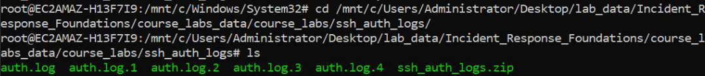
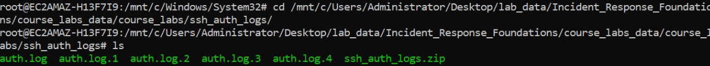
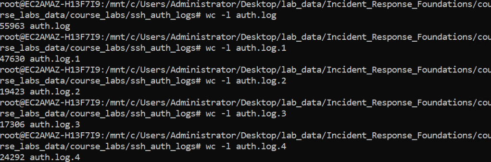
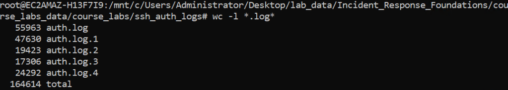
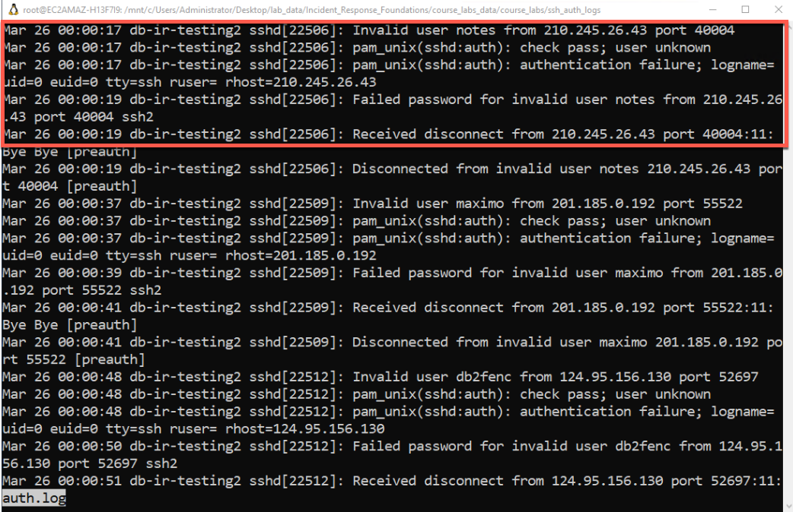
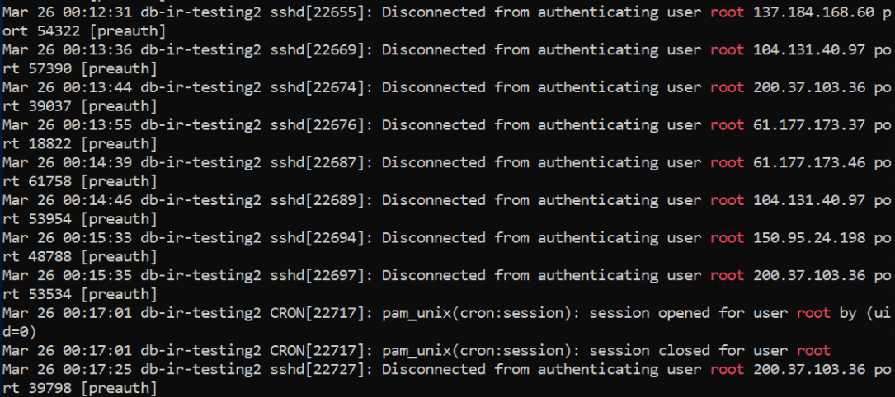
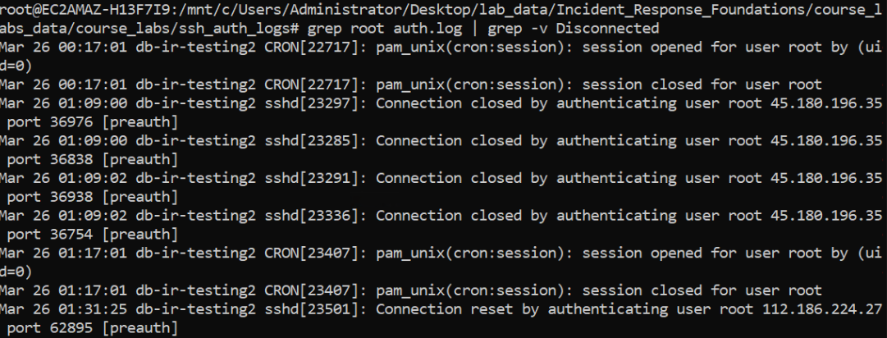
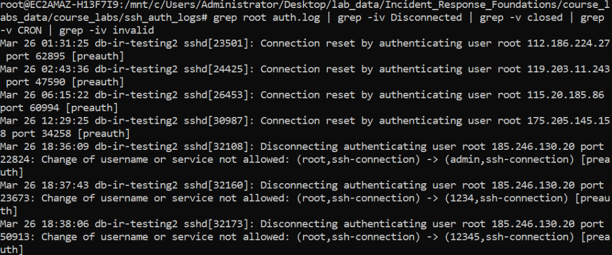
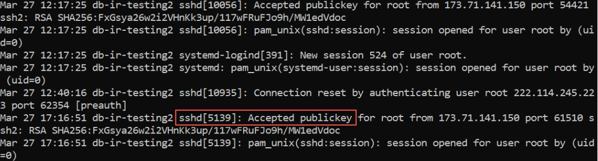
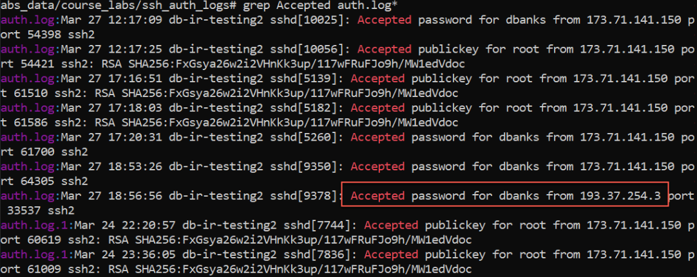

## Introduction to Command Line Data Analysis with Linux Log Files

This lab will introduce analyzing data with the Linux command line. Yes, Linux from a Windows machine. This is made possible from the [Windows Subsystem for Linux WSL](https://learn.microsoft.com/en-us/windows/wsl/about).

We will be looking at authentication logs from an Internet exposed Linux server.  You as the incident responder have been told that this system is exhibiting strange and unexpected behavior.  Your goal will be to determine if there was unauthorized access based on the log file contents.

In Debian and Ubuntu flavors of Linux, authentication logs are usually stored in the /var/log/auth.log.  In Red Hat and CentOS builds, they can be found in /var/log/secure.  The logs rotate weekly and get renamed with an appended numeric value, and older logs will be gzip compressed. 

While these logs may be familiar to you, its not the specific log file format that is important for this lab, but the process of taking a large amount of text data and using the Linux command line to find the few log entries we care about to answer our questions.  The goal is a data reduction process that can be applied to any text based log data.

From the desktop shortcut, double-click the `wsl - Shortcut` icon and launch WSL.  It may take a few moments for it to initialize. A prompt will appear ast the root user and it will default to the file location `/mnt/c/Windows/System32`.  


&nbsp;



&nbsp;

Type `cd /mnt/c/Users/Administrator/Desktop/lab_data/Incident_Response_Foundations/course_labs_data/course_labs/ssh_auth_logs/` to change to the directory that contains the authentication logs copied from the server in question.  Then use the `ls` to list the contents of the directory. 


&nbsp;


&nbsp;

Use the word count command (wc) with the -l flag to count the number of lines in each log file.  As with many things on the Linux command line, there are a few ways to accomplish this.  One way is to run `wc -l auth.log` on each file.

&nbsp;



&nbsp;

Another way would be to run one command and process all files using the wildcard character (*) and a commonality in the file name, commonly the extension.  For example the following command would do this and give a total line count of the files as well.

```
wc -l *.log*
``` 

&nbsp;



&nbsp;

Lets take a look at the structure of the file.  This structure will determine syntax how you process the text of a given log, for example commands for a comma separated value (CSV) file will differ slightly from a space separated or "human readable" format.  Sometimes, the "human readable" format, while easier to read, can be harder to process at scale versus a harder to read but more structured format.

There are many commands that can be used for displaying the text of a file.  Most of the time, less, head, and cat will meet your needs.  Each of these have slightly different features useful for text based processing.  Usually when just previewing a file, I prefer the less command.  Run `less auth.log` and read through the file for a moment.  You will see that there tends to be a few entries for each authentication type and we can use the text in the file to start select and filtering down data to answer our question of "Did unauthorized access occur?".

&nbsp;



&nbsp;

We can use the grep command in Linux to search through text data for a specific value.  It can be used to filter data located in files as well as data output to Standard Out (the scrolling text on the screen).  For example the command `grep root auth.log` will display all lines that have the value root in the most recent log file.  When investigating SSH authentication, looking at root authentication and working backwards through time is a good place to start .

Filtering out the root user makes 100 thousand lines of text down to 15 thousand, which while that is a significant reduction, thats still a lot of data to look through and that is still just one of the log files.


&nbsp;



&nbsp;

From the output above it looks like we can get rid of the "Disconnected authenticating user" messages to filter down the data.  To do that we can use the -v flag in grep to return the inverse of the value, so effectively filtering out the desired data and the "pipe" feature of Linux.  This allows use to chain together commands and build a pipeline of filtering down text data.  Run the following command:

```
grep root auth.log | grep -iv Disconnected

```


&nbsp;



&nbsp;


This actually only filtered out about 3000 lines, so we still need to reduce our data more.  We can keep chaining together grep commands to accomplish this.  Let's get rid of the lines that contain "closed", "CRON". and "invalid". At this point in the investigation we are worried about SSH not CRON jobs and are not concerned with invalid user account attempts to authenticate.  This gets us down to 59 lines, which is much closer to a number that we can manually look through efficiently.

```
grep root auth.log | grep -iv Disconnected | grep -v closed | grep -v CRON | grep -iv invalid

```

&nbsp;



&nbsp;

Reading through the output, we notice that the term "Accepted" seems to indicate a successful login over SSH, and in this case, root appeared to be using SSH Key pairs.  The IP address of the connecting client is also recorded.

&nbsp;



&nbsp;

Now we should use this information to see if we can find successful authentication attempts from other accounts and from what IP addresses the connections come from and look in all of the available logs.  We again use the grep command to search for the term "Accepted" in all of the authentication logs:

```
grep Accepted auth.log*
```

There are 34 lines so there is not a need for further filtering.  We can see that all of the successful authentications come from the IP address 173.71.141.150 except for one at 193.37.254.3.  This is certainly suspicious.

&nbsp;



&nbsp;

If we search for the 193.37.254.3 IP address in all of the authentication logs, we see thousands of failures for the dbanks user followed by a success.  This would seem to indicate that a password guessing attack was successful and the dbanks user was likely compromised on this server.

```
grep 193.37.254.3 auth.log*

```

&nbsp;


&nbsp;