## Zeek Command Line Analysis with THT

This lab will introduce Zeek logs and how to parse them with the Linux command line.  Since Zeek logs are text based, there are built in commands in Linux that are very useful for processing them.  It is possible to complete and entire investigation of events in Zeek logs just using the command line, in fact, in many ways it is the preferred method.

Recall from the course material that there are two formats for Zeek logs, Tab Separated Value (TSV) and JSON.  We will be using the TSV format for this lab.

Open the WSL command prompt used in the previous labs.

&nbsp;
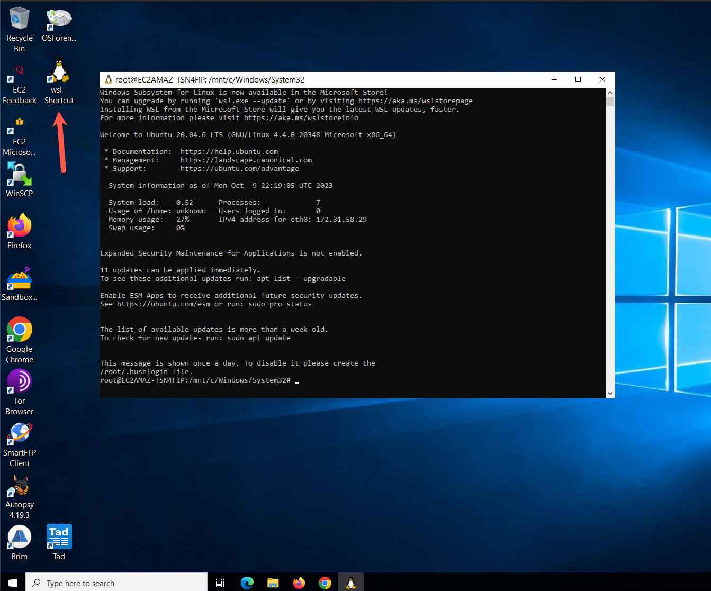
&nbsp;


Type `cd /mnt/c/Users/Administrator/Desktop/lab_data/Incident_Response_Foundations/course_labs_data/course_labs/network-zeek/`. Remember that tab complete is your friend!  Next perform a directory listing `ls -al`.   

You should see connection, SSL, DNS, and x509 gzipped compressed log types. Note that this is just a small subset of the number of logs that you would see on a production Zeek sensor.

We can tell by the names of the files the time range for the given day, and normally these files would be in a directory on the sensor for the given month, day and year.

&nbsp;
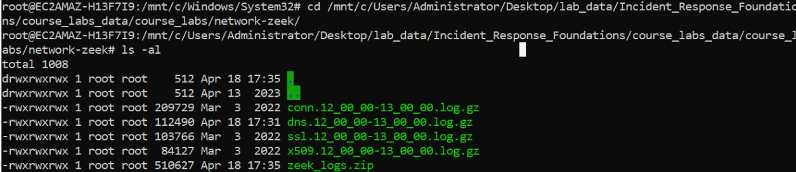

&nbsp;

We can work directly with gzip compressed files a the Linux command line with commands like `zcat` and `zgrep` and building a command pipeline to filter and search for what we want to find.  For example, we can count the number of lines in the connection log and display the first ten lines of the connection log so that we can take a look at the header file.

```
zcat conn.12_00_00-13_00_00.log.gz | wc -l
zcat conn.12_00_00-13_00_00.log.gz | head

```

&nbsp;
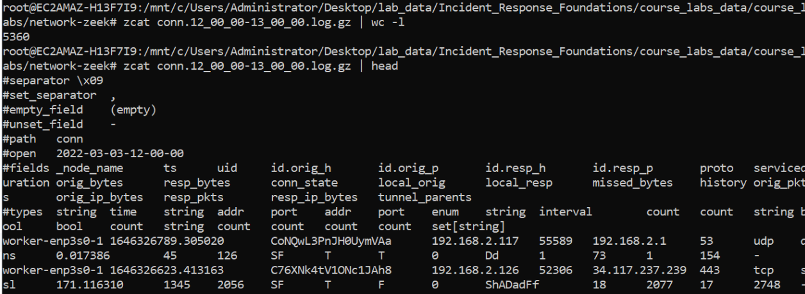

&nbsp;


One of the advantages of the TSV format is the ability to easily filter out a column of data.  The `zeek-cut` command facilitates this.  Run the following command to extract the value for each row in the 'service' column.  

```
zcat conn.12_00_00-13_00_00.log.gz | zeek-cut service | sort | uniq

```

While there may be times you want this output for every line, most of the time we probably want to do some further filtering.  Let's add some commands to the pipeline to find all the unique service values, or in other words, the services that Zeek recognized for that hour of traffic in the log files.  We will do that with the `sort` and `uniq` commands.

```
zcat conn.12_00_00-13_00_00.log.gz | zeek-cut service | sort | uniq

```

&nbsp;
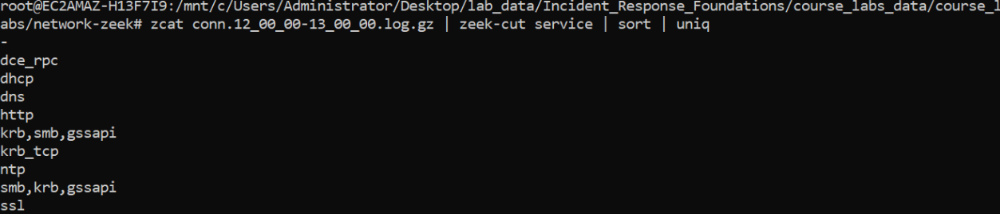

&nbsp;


That output is more useful than the individual values for each row.  We can add some command line flags and an additional `sort` command to get the count of each service value and arrange them from most to least frequent.  The `-c` flag for `uniq` provides a count for each unique value and the `-n` and `-r` flags for `sort` sort the values in the output numerically, then reverse that to make the data appear highest to lowest value.

```
zcat conn.12_00_00-13_00_00.log.gz | zeek-cut service | sort | uniq -c | sort -nr
```

&nbsp;
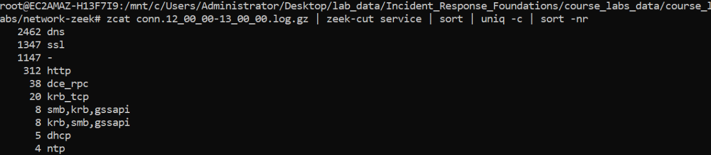

&nbsp;

This technique is known by a few names.  In a generic sense, we are 'data stacking', which means just what it sounds like, where we are stacking data on top of each other and counting it.  Often as an analyst looking at data different ways help to figure out elements of an investigation.  With data stacking, it's often possible to spot anomalous and interesting activity.  

Sorting the data from highest values to the lowest value is called 'short tail analysis' or 'most frequent occurrence'.  The opposite, sorting from lowest to highest value, is called 'long tail analysis' or 'least frequent occurrence'.  

The least frequent occurrence on this data can be accomplished with removing the `-r` from the last sort command.


```
zcat conn.12_00_00-13_00_00.log.gz | zeek-cut service | sort | uniq -c | sort -n
```
&nbsp;
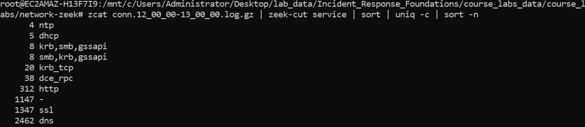

&nbsp;

Now let's use the same data stacking technique to take a look at most frequent occurrence of the 'server_name' field in the SSL log.  The domains in the number three and four spot for most frequent occurrence may look familiar from the previous host based lab, as they were the DNS lookups for a potentially malicious executable.


```
zcat ssl.12_00_00-13_00_00.log.gz | zeek-cut server_name | sort | uniq -c | sort -nr
```


&nbsp;
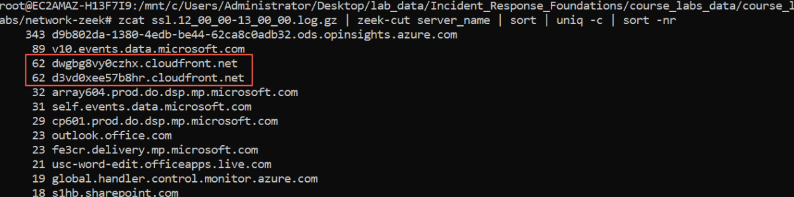

&nbsp;

Next lets add the `-d` flag to the zeek cut command to convert the timestamps to human readable format and add the `ts` (timestamp) field so that we get the time of each new SSL request.  We then will grep for both domains using the `-E` flag which uses 'extended regular expressions'.

```
zcat ssl.12_00_00-13_00_00.log.gz | zeek-cut -d ts server_name | grep -E "d3vd0xee57b8hr.cloudfront.net|dwgbg8vy0czhx.cloudfront.net"

```

&nbsp;
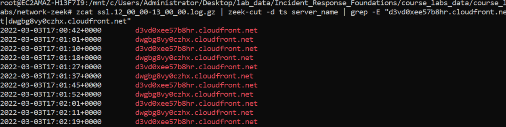

&nbsp;

It appears that there were 124 requests that spanned approximately 17 minutes of time.  That doesn't sound like a lot of time, but lets see if we can determine the IP addresses of the two cloudfront addresses so that we can then determine if data was exfiltrated.

We can use zeek-cut to get the queries and associated answers, but the output isn't ideal since we really want just the unique IP addresses in the answers field to then search through the conn.log.  

```
zcat dns.12_00_00-13_00_00.log.gz | zeek-cut query answers | grep -E "d3vd0xee57b8hr.cloudfront.net|dwgbg8vy0czhx.cloudfront.net"
```
&nbsp;
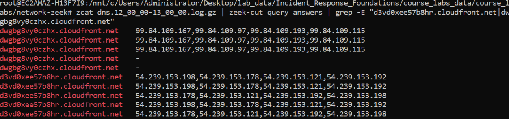

&nbsp;

You have a few choices to get the unique IP addresses from the output.  Since its not a lot of data, one way is to copy and paste the output into a text editor and manually filter the data.  There is nothing wrong with that, I have done it many times.  However what it were thousands of lines?  Doing the filtering at the command line would scale to that, where manual techniques may not.

The command below looks gnarly, but its not too bad once you know whats happening.  The first part up to the first cut command is the the search from above, we are now using cut with the `-f` field to get the second column of data that contains our answers.  

Next we are using the `tr` command to transform the data and removing the dash character.  Then we transform the data again to remove the comma and replacing it with a newline character so that the IP addresses appear on one line.  The last transform remove lines that start with a newline character.  Finally we `sort` and `uniq` the data.  This gives us a nice list of IP addresses we can copy and paste into our report.

```
zcat dns.12_00_00-13_00_00.log.gz | zeek-cut query answers | grep -E "d3vd0xee57b8hr.cloudfront.net|dwgbg8vy0czhx.cloudfront.net" | cut -f 2 | tr -d '-' | tr ',' '\n' | tr -s '\n' | sort | uniq
```

&nbsp;
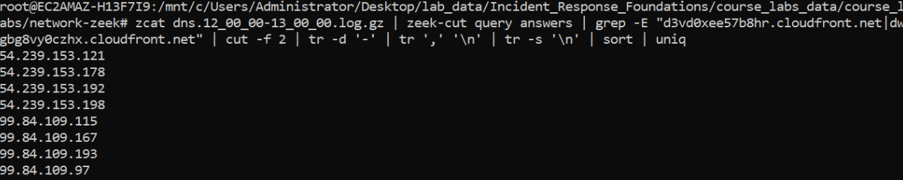

&nbsp;

We add one more transform to get the grep format we need to use to search the conn.log.  This will replace the newline character with a pipe. Note that the output can be a bit hard to read from the WSL terminal. In the screenshot below, the command is highlighted in white, and the output is called out in red.

```
zcat dns.12_00_00-13_00_00.log.gz | zeek-cut query answers | grep -E "d3vd0xee57b8hr.cloudfront.net|dwgbg8vy0czhx.cloudfront.net" | cut -f 2 | tr -d '-' | tr ',' '\n' | tr -s '\n' | sort | uniq | tr '\n' '|'

```
&nbsp;
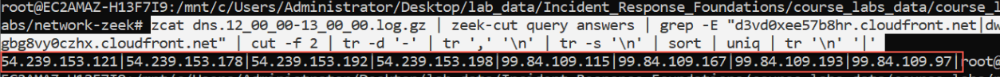

&nbsp;


Now we can search the conn log for the IP addresses related to our queries.  

Note that we are investigating cloudfront.com domains which is Amazon's Content Delivery Network and it is possible that there would be overlap with IP addresses in the data with non-malicious cloudfront.com domains in a larger and real world Zeek data and the UID field may be a better choice to pivot between log files.  For this lab, the IP addresses are easier to read and work with than the UID fields.

The following command will display each row that contains one of the IP addresses in our list.
```
zcat conn.12_00_00-13_00_00.log.gz | grep -E "54.239.153.121|54.239.153.178|54.239.153.192|54.239.153.198|99.84.109.115|99.84.109.167|99.84.109.193|99.84.109.97"

```
&nbsp;
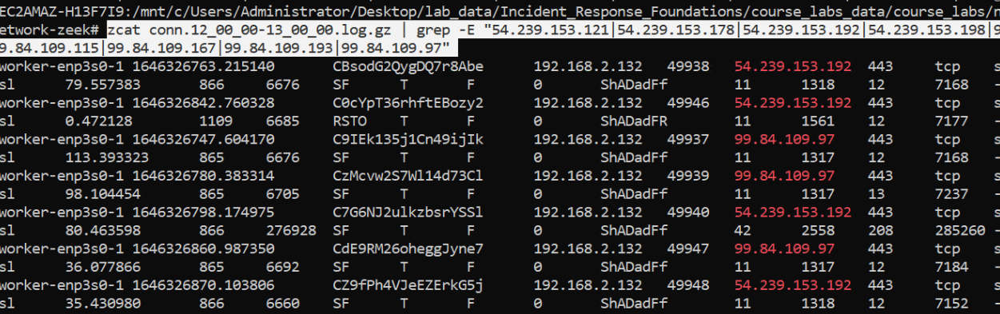

&nbsp;

To find whether or not we think that data was exfiltrated we will need four fields in the conn.log, the source and destination IP address and the bytes sent and received.  In the conn.log these fields are id.orig_h, id.resp_h, orig_bytes, and resp_bytes.

```
zcat conn.12_00_00-13_00_00.log.gz | zeek-cut id.orig_h id.resp_h orig_bytes resp_bytes | grep -E "54.239.153.121|54.239.153.178|54.239.153.192|54.239.153.198|99.84.109.115|99.84.109.167|99.84.109.193|99.84.109.97"
```

&nbsp;
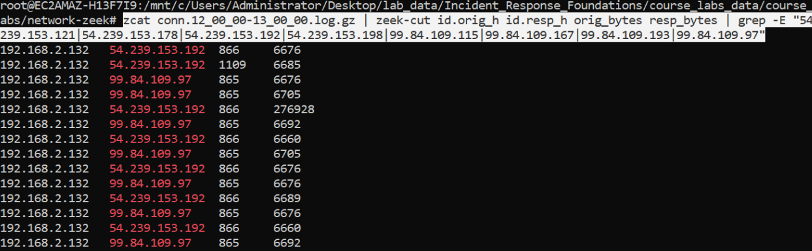

&nbsp;

We can see that the majority of the requests and response are 865 bytes and 6 KB in size with two that have around a 270 KB response.  This doesn't seem like a lot of data sent, so I think the answer would be no, data was not exfiltrated.

However it does seem like there was an active command and control channel for 17 minutes, so Defender may not have been able to completely prevent the malware from running.