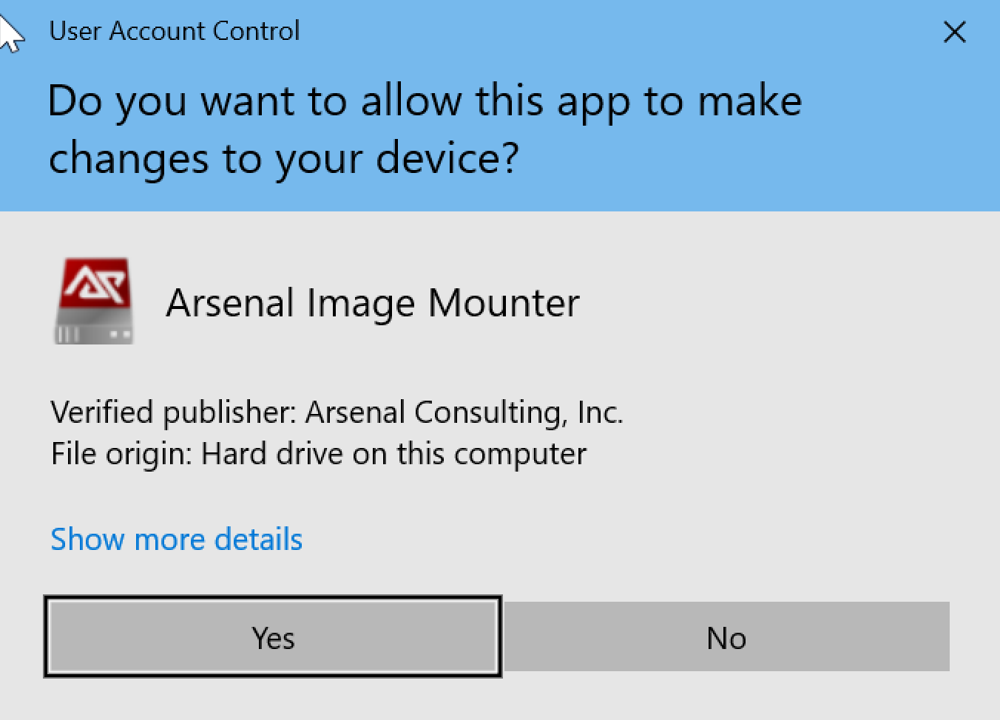
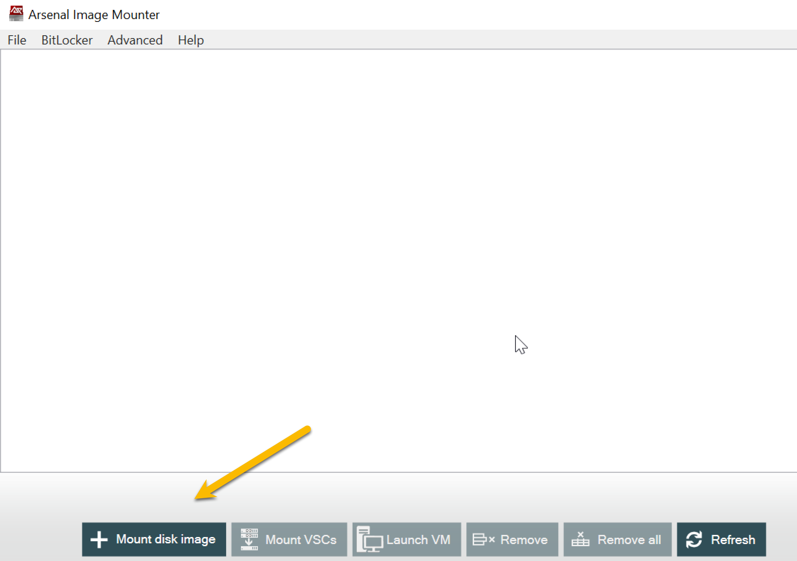
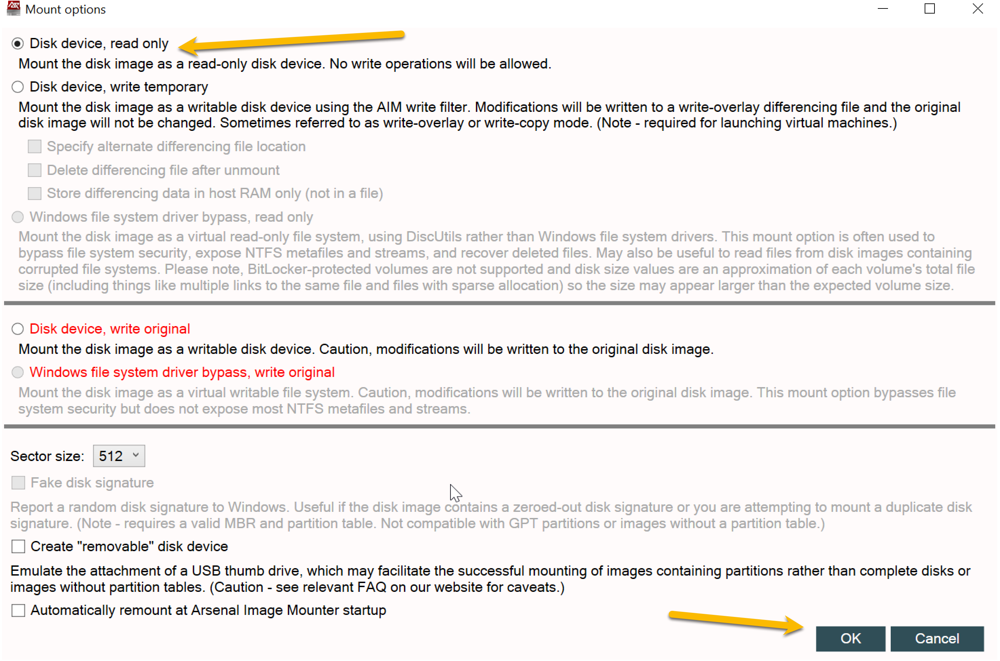
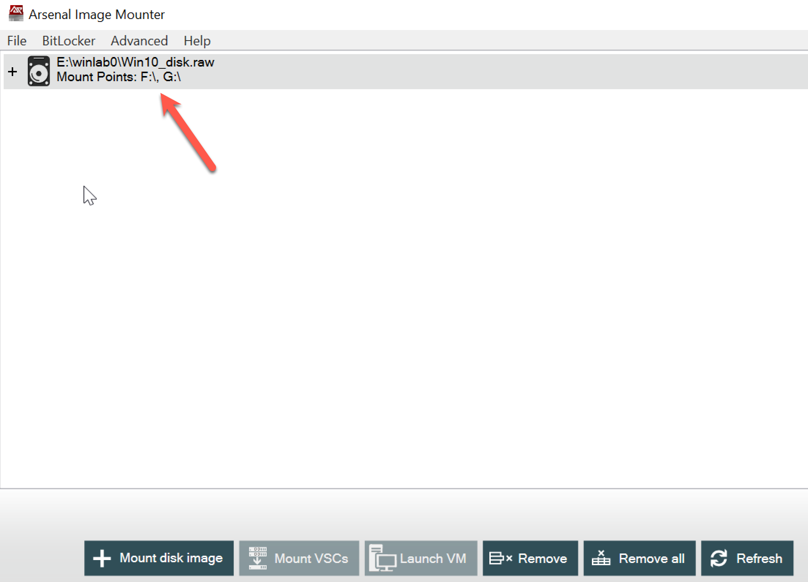
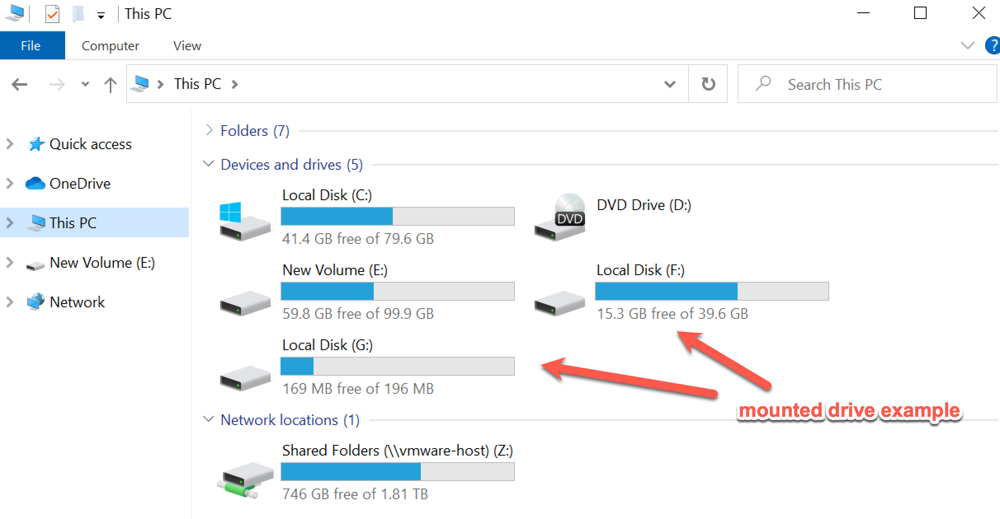
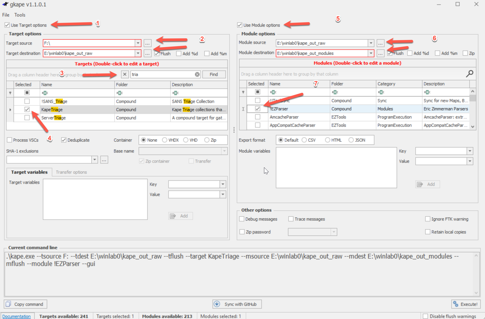

## KAPE Artifact Collection

### Note that this lab is optional and is provided for in case the student wants to collect their own KAPE data from a disk image.

This lab will demonstrate how to mount a raw disk image on a Windows host and use the Kroll Artifact Parser (KAPE) to collect and parse forensic artifacts.  KAPE can collect evidence from a live disk or a mounted image.

A raw disk image is a bit for bit copy of a physical disk, typically created with the Linux utility dd, but is common with other forensics software.  You will likely encounter raw disk images in your DFIRTH career.

You will need a Windows system with the following installed:

- [Aresenal Image Mounter](https://arsenalrecon.com/downloads) - the free version will be sufficient to mount a local disk image.
- [KAPE](https://www.kroll.com/en/services/cyber-risk/incident-response-litigation-support/kroll-artifact-parser-extractor-kape)

Note that the image file will need to be mounted from a local drive rather that over the network.  If you are using a virtual machine, you will need to make sure there is a disk in the VM with enough space for the disk image you need to mount.

You will need to allow Arsenal Image Mounter to make changes to the system.

Next click the Mount Image button and select the image file.

The defaults will work for our purposes.  Note that the default is to mount the image as "read only".  In almost all IR and forensics use cases, you will want to mount disk images as read only.

Arsenal Image Mounter should now show the mounted drives.  

For the Win10_disk.raw file should have two partitions, the boot partition and the data partition which should be drive letter F:

Now launch gkape.exe.  There are a few moving parts, so we will break it down into steps:

1. Select the "Use Target options" checkbox to be able to select options for data collection.
2. Select Target Source path.  This is the mounted drive you want to collect data from (in this example F:).  Select the "Target destination" path, this is where the collected data will be extracted. 
3. There are a lot of collection packages, searching for what you want is a good strategy.
4. Select the "KapeTriage" package.
5. Select the "Module options" checkbox.
6. The "Module source" path likely will match the "Target destination" path.  Choose a file system location for the "Module output" path.
7. Use the "!EZParser" module.

