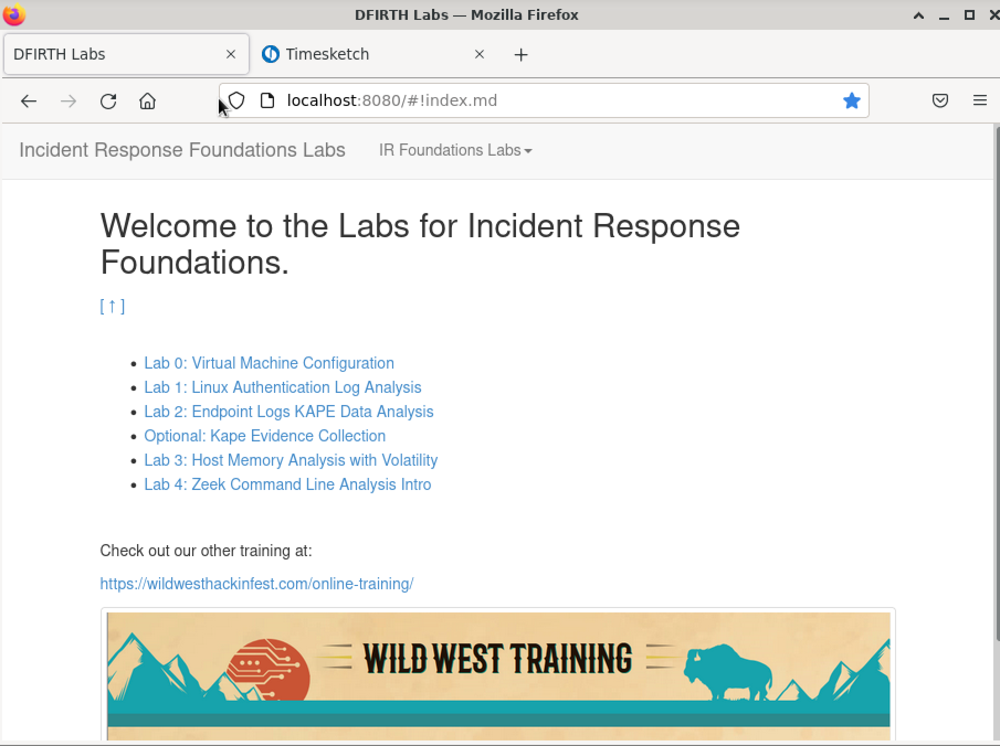
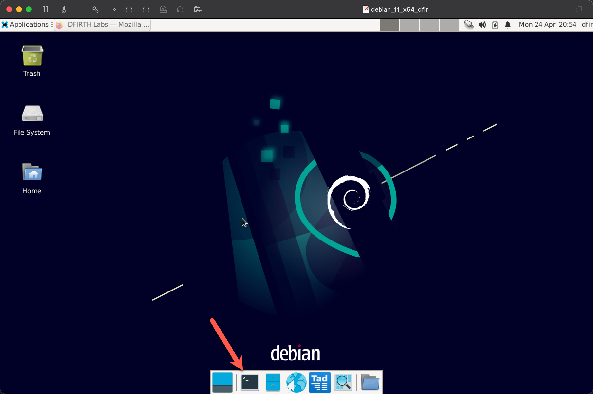
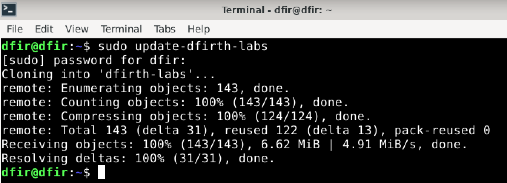
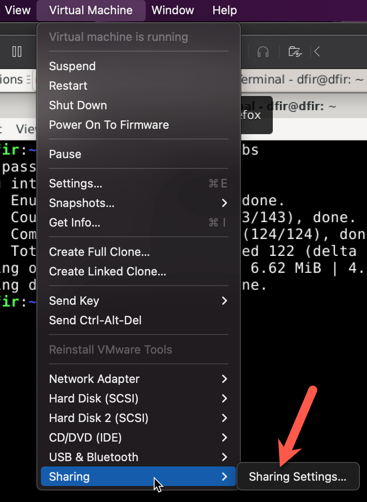
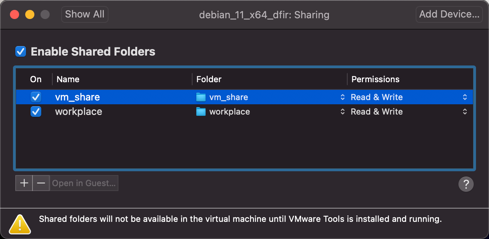
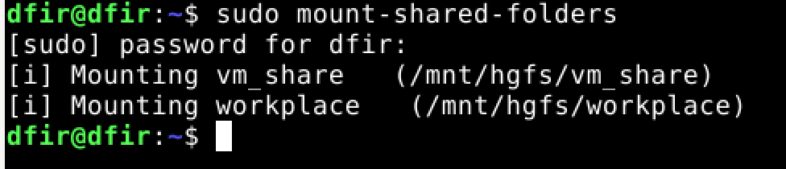

## Virtual Configuration

Welcome to the first lab for Incident Response Foundations.  The purpose of this lab is to introduce you to the virtual machine for this course.

As we will mention later in the material, in most circumstances, having a Linux based virtual machine will likely be a necessity in your DFIR endeavors.  If you are new to Linux, do not worry, like most things in the computer world its not hard, its just learning the right command line tricks and that comes from time spent at the command line with problems to solve! By the end of the course I hope that your comfort level has greatly increased from the command line tricks I will try to pass on to you.

Also, in case were wondering, you are welcome to use this VM for DFIR tasks outside of this course and modify as appropriate to suit your needs.  In fact, we use a version of this VM for Incident Response and Forensics engagements at BHIS.

Open the Firefox browser by clicking the browser icon in the menu bar.

&nbsp;

&nbsp;

The start pages for the browser will include the home page for the labs for the the course.

&nbsp;

&nbsp;

Next let's update the lab content in case something was fixed since the virtual machine was uploaded to AWS and copied to USB sticks... it most definitely was. Open a terminal window by clicking the icon in the menu bar. 

&nbsp;

&nbsp;

At the command prompt type:

```
sudo update-dfi
```

But before you hit enter, hit the tab button.

The command should auto complete to:

```
sudo update-dfirth-labs
```

What you just did, the tab completion part, was one of the tricks that make Linux Command Line Kung Fu blackbelts look like they are typing all the things so fast and accurate!  In reality, its really a more effective way to efficiently navigate directory structures and running more complex commands.  You should get in the habit of hitting tab very often at the Linux command line.

The other thing you just did was update the course lab material!

&nbsp;

&nbsp;

Another thing that you will likely need to do frequently in you DFIR career is to transfer data back and forth from your host system to the virtual machine.  Personally, for workstation class virtualization, and by that I mean running virtual machines on your laptop, I prefer shared folders through VMWare. 

Some folks in the security community would pause here and say something about memory exploits and VMWare host escapes.  By and large, those are much more of a risk to Internet exposed and multi-tenant hypervisors, and not really in the same risk model as running a local virtual machine on a laptop.  In my opinion, the risk does not outweigh the reward for most DFIR tasks that are not malware analysis (we will not be doing this).

Let's set up a shared drive, on your host system create a folder and name it something like "vm_share".

On VMWare Fusion, go to the "Virtual Machine" menu and select Sharing and Sharing Settings.


&nbsp;

&nbsp;

Next add an entry for your folder that you created.  Note that you will have to reboot the VM for the folder sharing to take effect.

&nbsp;

&nbsp;

After reboot, open the terminal window and type the following:

```
sudo mount-shared-folders
```
Don't forget to practice with tab completion!

&nbsp;

&nbsp;

Now the shared folder will be at the mount point `/mnt/hgfs/<your_folder_name>`