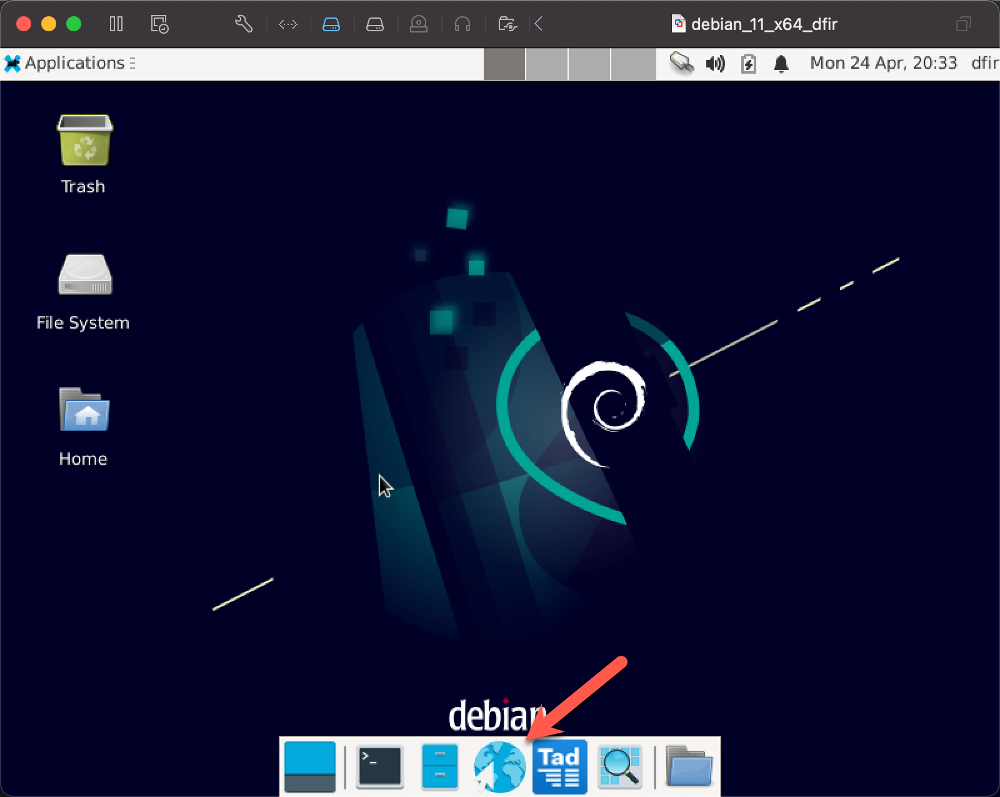

## Virtual Configuration

Welcome to the first lab for Incident Response Foundations.  The purpose of this lab is to introduce you to the virtual machine for this course.

As we will mention later in the material, in most circumstances, having a Linux based virtual machine will likely be a necessity in your DFIR endeavors.  You are welcome to use this VM for DFIR tasks outside of this course and modify as appropriate to suit your needs.  In fact, we use a version of this VM for Incident Response and Forensics engagements at BHIS.

Open the Firefox browser by clicking the broswer icon in the menu bar.

&nbsp;

&nbsp;