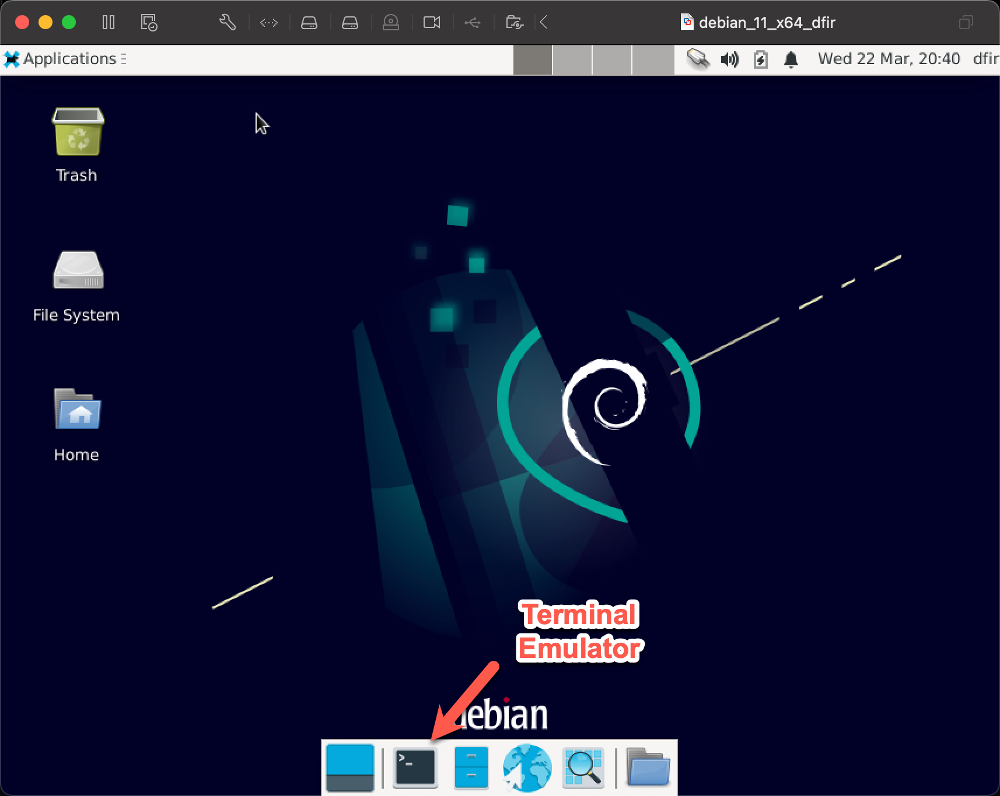
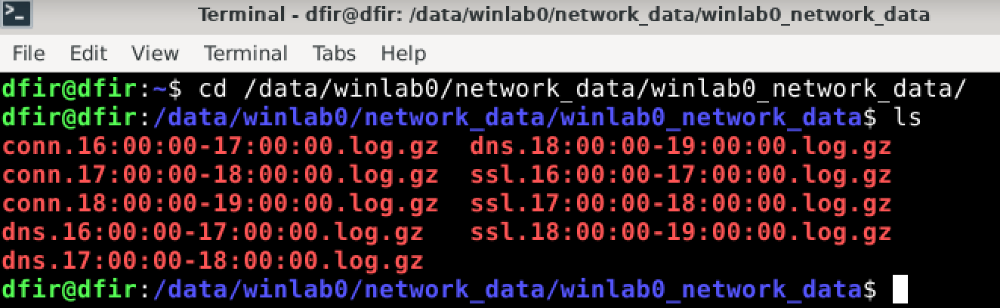

## Zeek Command Line Analysis with THT

This lab will introduce Zeek logs and how to parse them with the [Threat Hunter's Toolkit](https://github.com/ethack/tht), also known as THT.

Start with opening a terminal window in the course Virtual Machine.

Type `cd /data/winlab0/network_data/winlab0_network_data/` and then `ls`.  Remember that tab complete is your friend!  

You should see connection, dns, and ssl logs types.  Note that this is just a subset of the number of logs that you would see on a production Zeek sensor.

